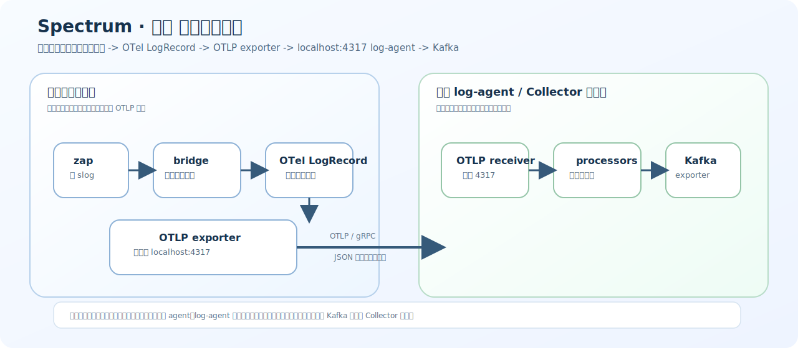

# Spectrum · 星谱 Go SDK

`Spectrum · 星谱` 是 `Stellar Axis（星轴）` 体系中的日志平台。

`spectrum-go-sdk` 是 `Spectrum · 星谱` 面向 Go 语言生态的官方 SDK 实现，负责在业务应用进程内完成日志桥接、日志标准化以及通过 OTLP 协议将日志发送到本机日志代理。

## 项目定位

本项目当前聚焦于 Go 语言日志接入链路，基于 OpenTelemetry Logs 与 OTLP 协议，提供统一的日志桥接能力，目标覆盖以下两类主流日志入口：

- `zap bridge`
- `slog bridge`

项目希望让业务应用无需直接感知底层 OTLP 细节，只需要继续使用熟悉的日志 API，即可将日志可靠接入 `Spectrum · 星谱` 的日志采集链路。

## 设计目标

- 为 Go 应用提供统一的 `zap` 与 `slog` 日志桥接能力
- 将业务日志转换为 OpenTelemetry `LogRecord`
- 通过 OTLP exporter 将日志发送到本机 `log-agent / Collector`
- 在开发环境输出到 `stdout` 与 `stderr`，便于本地调试
- 在生产环境输出到本机日志代理，并以 `JSON` 形式传输
- 尽可能保持业务侧原有日志调用方式不变

## 总体链路

当前项目面向的日志传输链路如下：

```text
业务应用进程内:
  zap
    -> bridge/appender
    -> OTel Logger / LogRecord
    -> OTLP exporter

本机 log agent / Collector 进程内:
  OTLP receiver
    -> processors
    -> Kafka exporter
```

在当前设计中，应用日志的核心发送路径为：

```text
zap / slog
  -> bridge
  -> OpenTelemetry LogRecord
  -> OTLP exporter
  -> localhost:4317
  -> log-agent
```

### Log Agent 流程图



当前推荐的生产链路说明如下：

- 业务应用进程内只负责产生日志、完成桥接和本地 OTLP 发送
- `log-agent` 监听 `localhost:4317`，作为本机统一日志入口
- `log-agent` 在本机完成接收、处理、增强、路由与转发
- Kafka exporter 属于 `log-agent / Collector` 进程职责，不直接暴露给业务应用

这样做的主要收益如下：

- 应用侧不感知后端 Kafka 或远端 Collector 拓扑
- 日志处理策略集中在本机 agent，便于统一演进
- 应用和平台之间只保留稳定的 OTLP 本地协议边界

## 核心能力规划

### 1. Zap Bridge

`zap bridge` 负责将 `zap.Logger`、`zap.SugaredLogger` 产生的日志事件转换为 OpenTelemetry Logs 语义，并透传以下信息：

- 日志级别
- 消息文本
- 时间戳
- 调用位置
- 错误对象
- 结构化字段
- 运行环境标识

### 2. Slog Bridge

`slog bridge` 负责将 Go 标准库 `log/slog` 产生的日志记录适配到同一条 OpenTelemetry 日志链路中，使 `zap` 与 `slog` 最终拥有一致的导出目标与日志语义。

### 3. OTLP Export

桥接层完成日志标准化后，统一交由 OTLP exporter 输出到本机代理，默认目标为：

```text
localhost:4317
```

该模式下，业务应用只负责本地发送，不直接耦合 Kafka、远端 Collector 拓扑或日志平台内部实现。

## 环境行为约定

### 开发环境

开发环境以可观测、易调试为优先，日志直接输出到：

- `stdout`
- `stderr`

推荐行为：

- 普通业务日志输出到 `stdout`
- 错误日志输出到 `stderr`
- 输出内容可保持开发友好的可读形式，必要时支持结构化字段展示

### 生产环境

生产环境以稳定采集和统一传输为优先，日志应通过 OTLP 发送到本机 `log-agent`，并采用 `JSON` 格式进行结构化传输。

推荐行为：

- 应用进程不直接写平台侧日志存储
- 应用进程不直接感知 Kafka exporter
- 统一发往本机 Agent，再由 Agent 完成后续处理与转发
- 所有结构化字段在传输过程中保持稳定的 JSON 语义

## 全局环境变量规范

`Stellar Axis（星轴）` 体系建议所有中间件统一遵循一套基础应用环境变量规范，详细定义见 [docs/environment-variable-spec.md](E:\PersonalCode\GoProject\spectrum-go-sdk\docs\environment-variable-spec.md)。

当前 `spectrum-go-sdk` 已按如下优先级读取配置：

1. 代码显式配置
2. `SPECTRUM_*` 产品级覆盖变量
3. `STELLAR_*` 全局基础变量
4. SDK 默认值

其中：

- `STELLAR_*` 用于平台统一注入的应用身份和部署拓扑元数据
- `SPECTRUM_*` 用于日志 SDK 自身的局部覆盖，例如 OTLP 地址、输出目标、日志级别

推荐的全局基础变量如下：

| 环境变量 | 说明 |
| :--- | :--- |
| `STELLAR_APP_NAME` | 当前应用名称 |
| `STELLAR_APP_NAMESPACE` | 当前应用逻辑命名空间 |
| `STELLAR_APP_VERSION` | 当前应用版本 |
| `STELLAR_APP_INSTANCE_ID` | 当前应用实例 ID |
| `STELLAR_ENV` | 当前环境 |
| `STELLAR_CLUSTER` | 当前集群 |
| `STELLAR_REGION` | 当前区域 |
| `STELLAR_ZONE` | 当前可用区 |
| `STELLAR_IDC` | 当前机房 |
| `STELLAR_HOST_NAME` | 当前主机名 |
| `STELLAR_HOST_IP` | 当前主机 IP |
| `STELLAR_NODE_NAME` | 当前节点名 |
| `STELLAR_K8S_NAMESPACE` | 当前 Kubernetes Namespace |
| `STELLAR_POD_NAME` | 当前 Pod 名 |
| `STELLAR_POD_IP` | 当前 Pod IP |
| `STELLAR_CONTAINER_NAME` | 当前容器名 |

## 推荐架构边界

为保证职责清晰，建议本仓库内部保持如下分层：

- `bridge`
  负责 `zap` 与 `slog` 的日志接入和适配
- `appender` 或 `core`
  负责日志事件转换、字段整理和环境路由
- `otel`
  负责 OpenTelemetry Logger、LogRecord 与 exporter 装配
- `config`
  负责开发环境与生产环境配置切换

## 快速开始

以下内容用于固定 `spectrum-go-sdk` 的推荐公开 API 形态，便于后续代码实现时保持一致。

由于仓库当前仍处于初始化阶段，下列代码示例描述的是“建议落地后的使用方式”，用于指导 SDK 包设计、初始化流程和对外接入约定。

### 初始化约定

推荐 SDK 对外暴露统一运行时入口，例如：

- `config`：负责配置模型定义
- `sdk`：负责资源、Provider、Exporter、Flush、Shutdown 生命周期管理
- `bridge/zapbridge`：负责 `zap` 适配
- `bridge/slogbridge`：负责 `slog` 适配

推荐初始化流程：

```text
加载配置
  -> 创建 SDK Runtime
  -> 根据环境装配 exporter / stdout writer
  -> 创建 zap 或 slog bridge
  -> 注入业务应用
  -> 应用退出时执行 Flush / Shutdown
```

### 运行示例

仓库已提供两个最小可运行示例：

- `go run ./examples/zap`
- `go run ./examples/slog`

默认行为如下：

- 自动读取 `STELLAR_*` 与 `SPECTRUM_*` 环境变量
- 如果未注入基础应用元数据，则回退到示例默认值
- 默认以开发模式输出到本地控制台

### Zap Bridge 初始化和接入示例

下面示例展示推荐的 `zap bridge` 接入形态：

```go
package main

import (
	"context"
	"log"
	"os/signal"
	"syscall"
	"time"

	"github.com/stellaraxis/spectrum-go-sdk/bridge/zapbridge"
	"github.com/stellaraxis/spectrum-go-sdk/config"
	"github.com/stellaraxis/spectrum-go-sdk/sdk"
	"go.uber.org/zap"
)

func main() {
	ctx, stop := signal.NotifyContext(context.Background(), syscall.SIGINT, syscall.SIGTERM)
	defer stop()

	cfg := config.Config{
		ServiceName:      "user-service",
		ServiceNamespace: "stellar.demo",
		ServiceVersion:   "1.0.0",
		Environment:      "dev",
		Endpoint:         "localhost:4317",
		Insecure:         true,
		Protocol:         "grpc",
		Format:           "json",
		Output:           "stdout",
		Level:            "info",
		Development:      true,
		EnableCaller:     true,
		EnableStacktrace: true,
	}

	runtime, err := sdk.New(ctx, cfg)
	if err != nil {
		log.Fatalf("init spectrum runtime failed: %v", err)
	}
	defer func() {
		shutdownCtx, cancel := context.WithTimeout(context.Background(), 5*time.Second)
		defer cancel()

		if err := runtime.Shutdown(shutdownCtx); err != nil {
			log.Printf("shutdown spectrum runtime failed: %v", err)
		}
	}()

	logger, err := zapbridge.NewLogger(runtime, zapbridge.Options{
		Name:          "user-service",
		AddCaller:     true,
		AddStacktrace: true,
	})
	if err != nil {
		log.Fatalf("create zap logger failed: %v", err)
	}

	logger.Info("user login success",
		zap.String("user_id", "u-1001"),
		zap.String("tenant_id", "t-01"),
		zap.String("request_id", "req-20260416-0001"),
	)

	logger.Error("query order failed",
		zap.String("user_id", "u-1001"),
		zap.String("order_id", "o-9001"),
		zap.String("error_code", "ORDER_TIMEOUT"),
		zap.Duration("cost", 350*time.Millisecond),
	)

	<-ctx.Done()
}
```

推荐 `zap bridge` 对外能力：

- 基于 `zapcore.Core` 或等价桥接层拦截日志事件
- 自动映射 `zap.Level` 到 OpenTelemetry Severity
- 自动透传 `zap.Field`
- 支持调用方、堆栈、错误对象、时间戳写入 `LogRecord`
- 支持开发环境输出到控制台，生产环境输出到 OTLP exporter

### Slog Bridge 初始化和接入示例

下面示例展示推荐的 `slog bridge` 接入形态：

```go
package main

import (
	"context"
	"log"
	"log/slog"
	"os/signal"
	"syscall"
	"time"

	"github.com/stellaraxis/spectrum-go-sdk/bridge/slogbridge"
	"github.com/stellaraxis/spectrum-go-sdk/config"
	"github.com/stellaraxis/spectrum-go-sdk/sdk"
)

func main() {
	ctx, stop := signal.NotifyContext(context.Background(), syscall.SIGINT, syscall.SIGTERM)
	defer stop()

	cfg := config.Config{
		ServiceName:      "billing-service",
		ServiceNamespace: "stellar.demo",
		ServiceVersion:   "1.0.0",
		Environment:      "prod",
		Endpoint:         "localhost:4317",
		Insecure:         true,
		Protocol:         "grpc",
		Format:           "json",
		Output:           "otlp",
		Level:            "info",
		Development:      false,
		EnableCaller:     true,
		EnableStacktrace: true,
	}

	runtime, err := sdk.New(ctx, cfg)
	if err != nil {
		log.Fatalf("init spectrum runtime failed: %v", err)
	}
	defer func() {
		shutdownCtx, cancel := context.WithTimeout(context.Background(), 5*time.Second)
		defer cancel()

		if err := runtime.Shutdown(shutdownCtx); err != nil {
			log.Printf("shutdown spectrum runtime failed: %v", err)
		}
	}()

	handler, err := slogbridge.NewHandler(runtime, slogbridge.Options{
		Name:      "billing-service",
		AddSource: true,
	})
	if err != nil {
		log.Fatalf("create slog handler failed: %v", err)
	}

	logger := slog.New(handler).With(
		slog.String("service", "billing-service"),
		slog.String("component", "invoice"),
	)

	logger.InfoContext(ctx, "invoice created",
		slog.String("invoice_id", "inv-1001"),
		slog.String("user_id", "u-1001"),
		slog.Int64("amount", 8800),
	)

	logger.ErrorContext(ctx, "push invoice failed",
		slog.String("invoice_id", "inv-1001"),
		slog.String("target", "kafka"),
		slog.String("reason", "timeout"),
	)

	<-ctx.Done()
}
```

推荐 `slog bridge` 对外能力：

- 基于 `slog.Handler` 实现桥接
- 自动映射 `slog.Level` 到 OpenTelemetry Severity
- 支持 `WithAttrs`、`WithGroup`、`AddSource`
- 支持 `context.Context` 中的链路信息透传
- 与 `zap bridge` 共用同一套 Runtime、Exporter 与配置模型

## 推荐包结构

建议仓库在后续实现中采用如下目录布局：

```text
spectrum-go-sdk/
├── bridge/
│   ├── zapbridge/
│   │   ├── logger.go
│   │   ├── core.go
│   │   └── converter.go
│   └── slogbridge/
│       ├── handler.go
│       ├── record.go
│       └── converter.go
├── config/
│   ├── config.go
│   ├── env.go
│   └── validate.go
├── sdk/
│   ├── runtime.go
│   ├── provider.go
│   ├── shutdown.go
│   └── flush.go
├── exporter/
│   ├── otlpgrpc.go
│   ├── stdout.go
│   └── router.go
├── internal/
│   ├── severity/
│   ├── attributes/
│   ├── resource/
│   └── jsonlog/
├── examples/
│   ├── zap/
│   └── slog/
└── README.md
```

各目录职责建议如下：

- `bridge/zapbridge`
  封装 `zap.Logger`、`zapcore.Core` 与字段转换逻辑
- `bridge/slogbridge`
  封装 `slog.Handler`、属性转换与上下文透传逻辑
- `config`
  统一管理配置结构、环境变量绑定和配置校验
- `sdk`
  对外提供统一初始化入口、Flush、Shutdown 能力
- `exporter`
  根据环境装配 `stdout/stderr` 或 OTLP exporter
- `internal`
  放置仅供内部复用的语义映射、JSON 编码、资源属性处理逻辑
- `examples`
  提供最小可运行示例，保证 README 中的示例最终有对应代码

## 推荐配置项设计

建议统一使用单一配置结构，例如：

```go
type Config struct {
	ServiceName        string
	ServiceNamespace   string
	ServiceVersion     string
	ServiceInstanceID  string
	Environment        string
	Cluster            string
	Region             string
	Zone               string
	IDC                string
	HostName           string
	HostIP             string
	NodeName           string
	K8sNamespace       string
	PodName            string
	PodIP              string
	ContainerName      string
	Endpoint           string
	Insecure           bool
	Protocol           string
	Format             string
	Output             string
	Level              string
	Development        bool
	EnableCaller       bool
	EnableStacktrace   bool
	BatchTimeout       time.Duration
	ExportTimeout      time.Duration
	MaxBatchSize       int
	MaxQueueSize       int
	Headers            map[string]string
	ResourceAttributes map[string]string
}
```

推荐字段语义如下：

| 配置项 | 类型 | 建议值 | 说明 |
| :--- | :--- | :--- | :--- |
| `ServiceName` | `string` | `user-service` | 服务名，写入 OTel Resource |
| `ServiceNamespace` | `string` | `stellar.demo` | 服务命名空间 |
| `ServiceVersion` | `string` | `1.0.0` | 服务版本 |
| `ServiceInstanceID` | `string` | `user-service-0` | 服务实例 ID |
| `Environment` | `string` | `dev` / `test` / `prod` | 环境标识 |
| `Cluster` | `string` | `cluster-sh-prod-01` | 集群标识 |
| `Region` | `string` | `cn-east-1` | 区域标识 |
| `Zone` | `string` | `cn-east-1a` | 可用区标识 |
| `IDC` | `string` | `sh-a` | 机房标识 |
| `HostName` | `string` | `node-01` | 主机名 |
| `HostIP` | `string` | `10.0.0.10` | 主机 IP |
| `NodeName` | `string` | `worker-01` | 节点名 |
| `K8sNamespace` | `string` | `trade` | Kubernetes Namespace |
| `PodName` | `string` | `user-service-0` | Pod 名 |
| `PodIP` | `string` | `10.1.0.20` | Pod IP |
| `ContainerName` | `string` | `app` | 容器名 |
| `Endpoint` | `string` | `localhost:4317` | 本机 agent 地址 |
| `Insecure` | `bool` | `true` | 本机链路通常可直接明文 |
| `Protocol` | `string` | `grpc` | OTLP 传输协议 |
| `Format` | `string` | `json` | 生产环境建议固定为 `json` |
| `Output` | `string` | `stdout` / `stderr` / `otlp` | 输出目标 |
| `Level` | `string` | `debug` / `info` / `warn` / `error` | 最低日志级别 |
| `Development` | `bool` | `true` / `false` | 是否启用开发模式 |
| `EnableCaller` | `bool` | `true` | 是否采集调用位置 |
| `EnableStacktrace` | `bool` | `true` | 是否采集错误堆栈 |
| `BatchTimeout` | `time.Duration` | `5s` | 批处理超时 |
| `ExportTimeout` | `time.Duration` | `3s` | 单次导出超时 |
| `MaxBatchSize` | `int` | `512` | 单批最大条数 |
| `MaxQueueSize` | `int` | `2048` | 本地队列大小 |
| `Headers` | `map[string]string` | 自定义 | OTLP 透传请求头 |
| `ResourceAttributes` | `map[string]string` | 自定义 | 额外资源属性 |

### 环境默认值建议

建议 SDK 根据环境自动生成默认行为：

| 环境 | `Output` | `Format` | `Endpoint` | 说明 |
| :--- | :--- | :--- | :--- | :--- |
| `dev` | `stdout` / `stderr` | `console` 或 `json` | 可空 | 本地调试优先 |
| `test` | `otlp` | `json` | `localhost:4317` | 联调环境与生产一致 |
| `prod` | `otlp` | `json` | `localhost:4317` | 统一走本机 agent |

### 环境变量建议

建议 SDK 按“全局基础变量 + 产品级覆盖变量”两层读取：

#### 全局基础变量

| 环境变量 | 对应字段 |
| :--- | :--- |
| `STELLAR_APP_NAME` | `ServiceName` |
| `STELLAR_APP_NAMESPACE` | `ServiceNamespace` |
| `STELLAR_APP_VERSION` | `ServiceVersion` |
| `STELLAR_APP_INSTANCE_ID` | `ServiceInstanceID` |
| `STELLAR_ENV` | `Environment` |
| `STELLAR_CLUSTER` | `Cluster` |
| `STELLAR_REGION` | `Region` |
| `STELLAR_ZONE` | `Zone` |
| `STELLAR_IDC` | `IDC` |
| `STELLAR_HOST_NAME` | `HostName` |
| `STELLAR_HOST_IP` | `HostIP` |
| `STELLAR_NODE_NAME` | `NodeName` |
| `STELLAR_K8S_NAMESPACE` | `K8sNamespace` |
| `STELLAR_POD_NAME` | `PodName` |
| `STELLAR_POD_IP` | `PodIP` |
| `STELLAR_CONTAINER_NAME` | `ContainerName` |

#### Spectrum 产品级覆盖变量

| 环境变量 | 对应字段 |
| :--- | :--- |
| `SPECTRUM_SERVICE_NAME` | `ServiceName` |
| `SPECTRUM_SERVICE_NAMESPACE` | `ServiceNamespace` |
| `SPECTRUM_SERVICE_VERSION` | `ServiceVersion` |
| `SPECTRUM_SERVICE_INSTANCE_ID` | `ServiceInstanceID` |
| `SPECTRUM_ENVIRONMENT` | `Environment` |
| `SPECTRUM_ENDPOINT` | `Endpoint` |
| `SPECTRUM_PROTOCOL` | `Protocol` |
| `SPECTRUM_OUTPUT` | `Output` |
| `SPECTRUM_FORMAT` | `Format` |
| `SPECTRUM_LEVEL` | `Level` |
| `SPECTRUM_INSECURE` | `Insecure` |
| `SPECTRUM_DEVELOPMENT` | `Development` |

## 推荐对外 API 设计

为了同时兼容 `zap` 和 `slog`，建议公共 Runtime 对外维持如下能力边界：

- `sdk.New(ctx, cfg)`：创建资源、Provider、Exporter 与内部队列
- `runtime.Flush(ctx)`：主动刷新缓存日志
- `runtime.Shutdown(ctx)`：优雅关闭导出链路
- `runtime.LoggerProvider()`：为桥接层提供统一日志 Provider

桥接层建议分别提供：

- `zapbridge.NewLogger(runtime, options)`
- `slogbridge.NewHandler(runtime, options)`

这样可以保证：

- `zap` 与 `slog` 不重复初始化 exporter
- 应用进程只维护一份日志导出生命周期
- 开发环境与生产环境的切换由配置层统一收敛
- 后续如果新增 `logrus` 等桥接，也可以复用同一套 Runtime

## 当前 README 范围

由于仓库当前仍处于初始化阶段，本文档先固定以下内容：

- 品牌与命名语义
- Go SDK 的职责边界
- `zap bridge` 与 `slog bridge` 的建设目标
- 开发环境与生产环境的日志输出约定
- 与本机 `log-agent` 的 OTLP 对接方式

后续随着代码实现推进，README 将继续补充：

- 包结构说明
- 初始化示例
- `zap` 接入示例
- `slog` 接入示例
- 配置项说明
- 本地调试与联调方式

## 命名说明

根据 `Stellar Axis（星轴）` 体系的统一命名规则：

- 日志平台名称：`Spectrum · 星谱`
- Go SDK 名称：`spectrum-go-sdk`

其中：

- `spectrum` 表示日志平台产品归属
- `go` 表示语言维度
- `sdk` 表示工程角色

`OpenTelemetry` 作为内部实现能力与协议适配能力存在，但不进入当前仓库的对外主命名。

## License

Apache License 2.0
